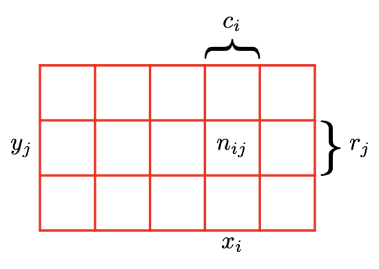
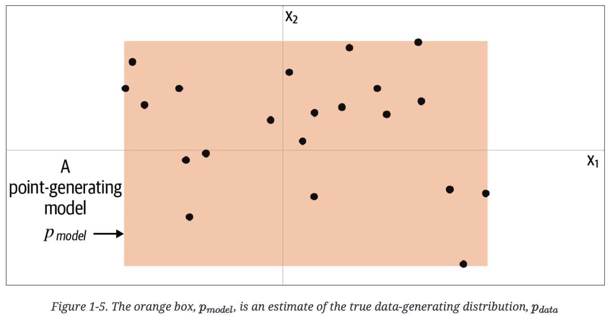
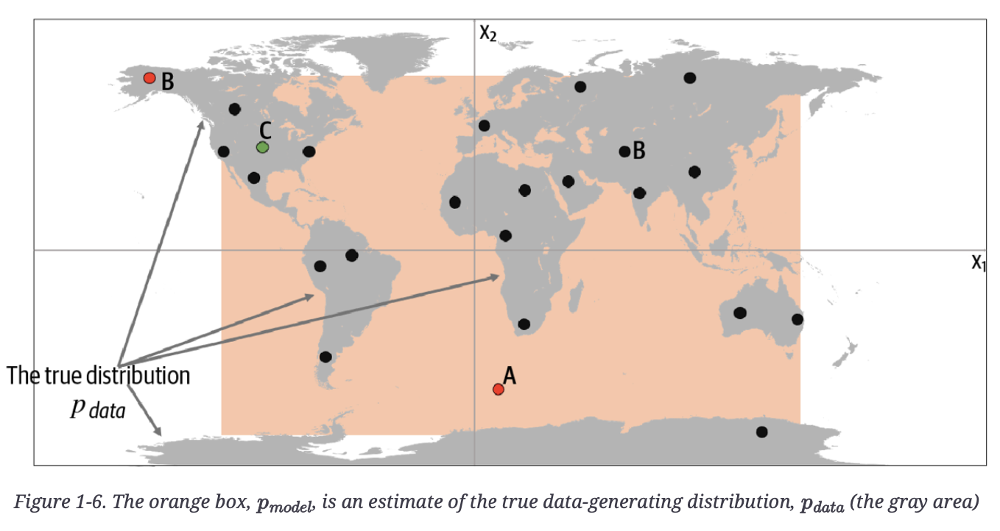

## Probability mass function and probability density function

These notes are from MIT's 18.05 Open Courseware, copy embedded below since MIT often shifts around their website so links are unstable.

Probability *density* function → $P(c≤X≤d)=\int_{c}^{d}f(x)dx$ 
Probability *mass* function → $p(a)=P(X=a)$

"Why do we use the terms mass and density to describe the pmf and pdf? What is the difference between the two? The simple answer is that these terms are completely analogous to the mass and density you saw in physics and calculus." Mass as a sum of discrete points of mass or an integral of a density function. Also, "for both discrete and continuous random varialbes, the expected value is simply the center of mass or balance point."

Continuous Random Variables
[MIT 18.05 Class 5 Prep PDF](mit18_05_s22_class05-prep-b.pdf)

Discrete Random Variables
[MIT 18.05 Class 4 Prep PDF](mit18_05_s22_class04-prep-a.pdf)

## ROC Receiver Operator Characteristic

The ROC is a graph that shows the trade off of true positive rate (TPR=TP/P) and false positive rate (FPR=FP/N), where the y-axis is TPR and x-axis is FPR, and the curve is traversed as a function of the discrimination threshold (the value above which the sample x is considered P, or positive). So as the discrimination threshold approaches 1 the curve goes to the upper right where TPR = 1 and FPR = 1. A different way to visualize this trade off is on a probability distribution graph showing the $p(X=x \mid Y=0)$ and $p(X=x \mid Y=1)$ probability density functions, below. TPR is the CDF of $p(X=x \mid Y=1)$ where x>discrimination threshold, and FPR is that of $p(X=x \mid Y=0)$.


## Product rule and summation rule for probability

That then got me thinking about Bayes theorem, which led to a refresher on the summation rule and product rule of probability. I've found both are intuitively understood using Bishop's illustration showing the values of two random variables, X, which takes the values $x_i$ and $Y$, which takes the values $y_j$, and then considering the points in column $i$, corresponding to $X = x_i$, is denoted by $c_i$.

### Summation Rule
The summation rule is that $p(X=x_i)=\sum_{j=1}^Lp(X=x_i,Y =y_j)$. Bishop notes "Note that $p(X = x_i)$ is sometimes called the marginal probability, because it is obtained by marginalizing, or summing out, the other variables (in this case $Y$ )."

### Product Rule
From that we define conditional probability, $p(Y = y_j \mid X = x_i) = n_{ij}/c_i$. And from that we have $p(X=x_i,Y=y_j) = n_{ij}/N = n_{ij}/c_i · c_i/N = p(Y = y_j \mid X = x_i)p(X = x_i)$, which is the product rule.
And Bayes Theorem comes from applying the symmetry rule p(X, Y ) = p(Y, X) to the product rule:

$$p(Y \mid X) = \frac{p(X \mid Y)p(Y)}{p(X)}$$

Bishop also discusses applying Bayes Theorem to learning about model parameters, w, given a sample output from the model, D, where the likelihood function is:

$$p(w \mid D) = \frac{p(D \mid w)p(w)}{p(D)}$$

or in words, **posterior ∝ likelihood × prior**.

## Likelihood function is not a probability density function

I finally understand why the integral over w of $P(D \mid w)$, the likelihood function, won't necessarily be 1. Bishop says $p(D \mid w)$, the likelihood function, "expresses how probable the observed data set is for different settings of the parameter vector w. Note that the likelihood is not a probability distribution over w, and its integral with respect to w does not (necessarily) equal one. "
Claude explained "the likelihood function is not a probability distribution over w because it's not describing the probability of w occurring. Instead, it's describing how well each possible value of w explains the observed data D." In simpler terms, the typical conditional probability example in textbooks assumes w is a fixed condition, so that the conditional probabilities D integrated over fixed condition w equals 1. However for this application, D is fixed and w can vary (this question is Bishop's fruit example, fruit picked was D=Apple, so which box did the apple come from - what was the prior that most likely resulted in apple being picked). So in the textbook example case, for any particular w (set of model parameters), the integral of samples D over that w is 1. But in the reverse case where the prior is the model parameters w, w is no longer fixed, so integrating over w will not necessarily be 1.

This is a subtle but crucial distinction in probability theory and statistics - ==likelihood functions measure the plausibility of parameters given fixed data, while probability distributions measure the likelihood of data given fixed parameters.==

## Toy examples of likelihood estimators

A nice example Claude gave was flipping a biased coin, where the parameter w is the probability of heads, which can be any value between 0 and 1. Our data D is a single flip that came up heads.

The likelihood function would be:

$$L(w) = p(D \mid w) = w$$

If we integrate this over all possible values of w from 0 to 1, we get:

$$\int_0^1 w \, dw = 1/2$$

This integral equals 1/2, not 1. The reason this happens is that we're not summing over all possible outcomes for a given w. Instead, we're summing over all possible w for a given outcome. These are fundamentally different operations.

Generative Deep Learning (GDL) had a nice toy example below of a parameter-based and data, where the orange box is a model, pmodel, of an underlying distribution, pdata.



Below, the author reveals the true underlying data in grey, pdata, a uniform distribution over the land mass of the world.

Point A is an observation that is generated by our model but does not appear to have been generated by $p_{data}$ as it’s in the middle of the sea.

Point B could never have been generated by $p_{model}$ as it sits outside the orange box. Therefore, our model has some gaps in its ability to produce observations across the entire range of potential possibilities.

Point C is an observation that could be generated by and also by $p_{data}$.

Since it is a parametric model, it represents a family of density functions $p_𝛳(x)$ that is described with an infinite number of parameters, 𝛳. In the example above, the map is uniquely represented by the four border positions, 𝛳=(𝛳1,𝛳2,𝛳3,𝛳4).

## Bayesian vs Frequentist consideration of Likelihood Function

>In both the Bayesian and frequentist paradigms, the likelihood function $p(D \mid w)$ plays a central role. However, the manner in which it is used is fundamentally different in the two approaches.
>
>In a Frequentist setting, $w$ is considered to be a fixed parameter, whose value is determined by some form of 'estimator', and error bars on this estimate are obtained by considering the distribution of possible data sets $D$.
>
>By contrast, from the Bayesian viewpoint there is only a single data set $D$ (namely the one that is actually observed), and the uncertainty in the parameters is expressed through a probability distribution over $w$.

\- Bishop, PRML

Frequentists would use MLE to find the parameters, $w$, that maximize the likelihood function.

Bayesian uses Bayes Theorem to combine the likelihood function with a prior to get a posterior probability function for the parameters, $w$.
 
## Likelihood Estimation 

For training for next token prediction for a decoder-only LLM, we want to find the parameters $\theta$ that maximize the probability for the correct token, conditioned on the previously generated tokens in the sequence. Suppose our vocabulary is the tokens ["please", "pass", "the", "salt", "pepper", "fork"]. Consider the training sequence "please pass the salt". There would be three training examples generated:
1. First, the model needs to predict "pass" given "please"
2. Then predict "the" given "please pass"
3. Then predict "salt" given "please pass the"
Focusing on the last prediction, suppose the model outputs the following probabilities for next token:
```python
P(salt | "please pass the") = 0.5
P(pepper | "please pass the") = 0.3
P(fork | "please pass the") = 0.2
```

If "salt" was the actual next word in our training data, then our likelihood function is

$$\mathscr{L}(\theta \mid x) = p_\theta (x)$$

where $\theta$ are our model parameters and $x$ is our single observation, "salt". Again, keep in mind it is a function of $\theta$, not $x$, so it sums to 1 only over $x$, not over $\theta$.

We have a set of observations (e.g., the entire sequence above), so we apply the model parameters $\theta$ to the entire sequence. Since if the parameters are correct for generating the correct probabilities, and our observations are the ground truth (the training set), then *all* of the observations must be true, so the likelihood estimator is the joint probability of the observed data (i.e., the data could not include Point B from the map toy example above). Referring to the map toy example above

>In the world map example, the MLE is the smallest rectangle that still contains all of the points in the training set.

\- Foster, GDL

Then the likelihood function formed from the joint probability is

$$\mathscr{L}(\theta \mid X)=\prod_{x \in X}p_\theta(x) $$

where $X$ the data set, the three training examples above.

## Negative Log Likelihood

Taking the $log_e$ of the likelihood estimator makes things easier.

>In the machine learning literature, the negative log of the likelihood function is called an _error function_. Because the negative logarithm is a monotonically decreasing function, maximizing the likelihood is equivalent to minimizing the error.

\- Bishop, PRML

Plus log turns the MLE product series into a computationally cheaper summation. The likelihood estimator becomes the log likelihood estimator:

$$\mathscr{l}(\theta \mid X) = \sum_{x \in X}\log p_\theta(x)$$

Again, given we've observed dataset $X$, then the value $\mathscr{l}(\theta \mid X)$ is the likelihood that we would see actually $X$ if the parameters $\theta$ parametrized the probability distribution used to generate that data.

So if our LLM *currently* had parameters $\theta$ and we see that it generated the data set $X$, then the value $\mathscr{l}(\theta \mid X)$ would be high. If that data set is not what we want, then we should find different parameters with the true (or at least better) probability distribution that will generate the data we want.

## Maximum Likelihood Estimation (MLE)

Maximum Likelihood Estimation is a method that will let us find a $\hat{\theta}$ from all the possible $\theta$ that maximizes the likelihood function above. Specifically:

$$\hat{\theta}=\underset{x}{\operatorname{argmax}} \mathscr{l}(\theta \mid X) $$

Applying a negative sign so that we are minimizing loss:

$$ \hat{\theta} = \underset{\theta}{\operatorname{argmin}}(-\ell(\theta \mid \mathbf{X})) = \underset{\theta}{\operatorname{argmin}}(-\log p_\theta(\mathbf{X})) $$

Returning to the third prediction from the toy example above (predict "salt" given "please pass the"), the cross entropy loss (the negative of the MLE) from the correct answer is

$$ \begin{align} \text{Cross Entropy Loss}
& = -log(P(\text{correct token})) \\
& = -log(P(\text{"salt"})) \\
& = -log(0.5) ≈ 0.693
\end{align}  $$

Since the cross entropy is the joint probability of the entire dataset, we apply all three examples, to

$$\text{Cross Entropy Loss } = -\sum \log p(\text{token}_i \mid \text{context} ) $$

For example, for a sequence in the training data "please pass the salt for dinner", the contribution to the Cross Entropy Loss might then be
```python
Loss = -[ log P("pass" | "please")
        + log P("the" | "please pass")
        + log P("salt" | "please pass the")
        + log P("for" | "please pass the salt")
        + log P("dinner" | "please pass the salt for") ]
```

Total Cross Entropy Loss would be accumulated for all the sequences in the batch, and then gradients would be computed and parameters, $\theta$, updated. 

So Cross Entropy Loss and MLE are related by the following, for the sequence "please pass the": 
```python
MLE = P(salt | please pass the) * P(pass | please) * P(the | please pass)

-log(MLE) = -[log P(salt | please pass the) + log P(pass | please) + log P(the | please pass)]
```

These relate to Perplexity as follows (where "NLL" is Negative Log Likelihood):
```python
# First calculate NLL for each position:
NLL_pass = -log P("pass" | "please")               # let's say = -log(0.8) = 0.223
NLL_the = -log P("the" | "please pass")            # let's say = -log(0.9) = 0.105
NLL_next = -log P("salt" | "please pass the")      # let's say = -log(0.5) = 0.693

# Average NLL
avg_NLL = (0.223 + 0.105 + 0.693) / 3 = 0.340

# Perplexity
perplexity = exp(0.340) ≈ 1.405
```

The perplexity of 1.405 means that the model was very sure about "pass" after "please" (0.8 probability), very sure about "the" after "please pass" (0.9 probability), and less sure about "salt" after "please pass the" (0.5 probability).

- Perplexity = exp(average_NLL) can be interpreted as the exponential of the average negative log likelihood
- It represents how many "equally likely choices" the model is effectively choosing between
- The model's uncertainty is equivalent to choosing between about 1.4 equally likely options
- This is a very low perplexity, indicating high confidence
- If the model were totally confused between 4 equally likely options, the perplexity would be 4
